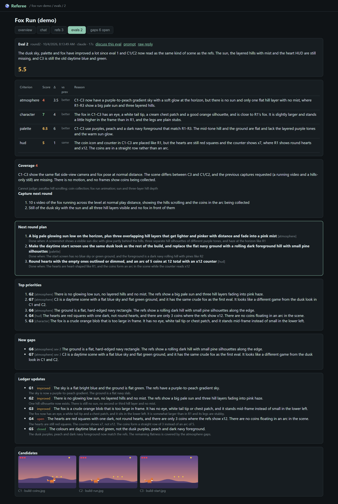
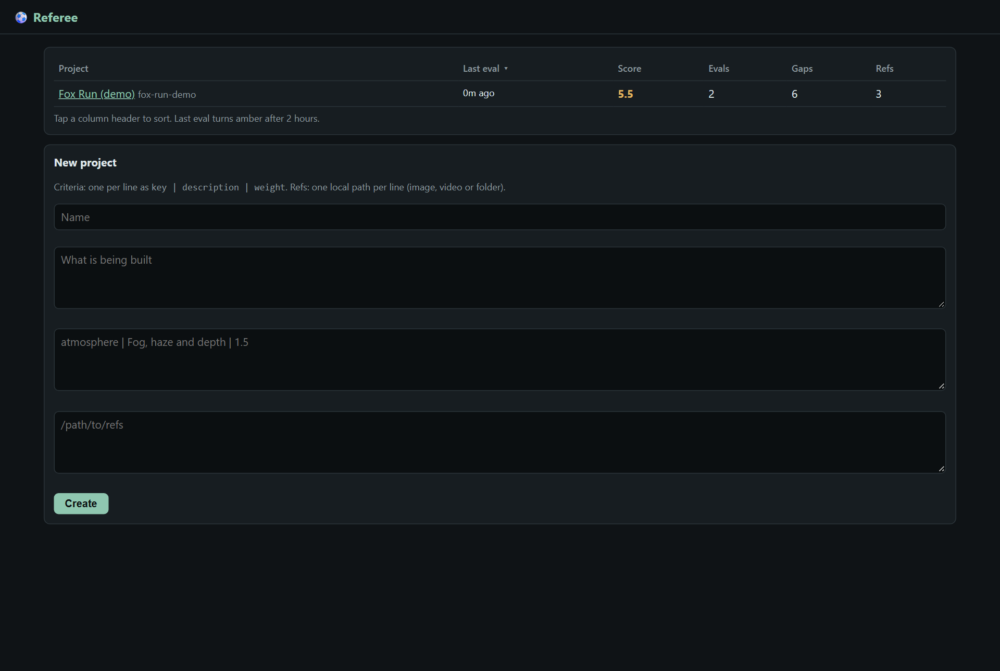
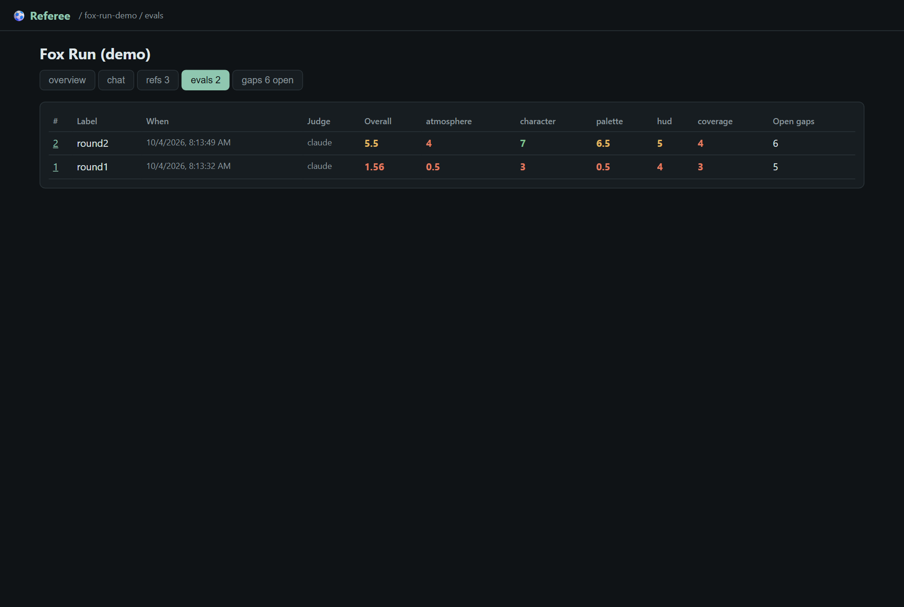
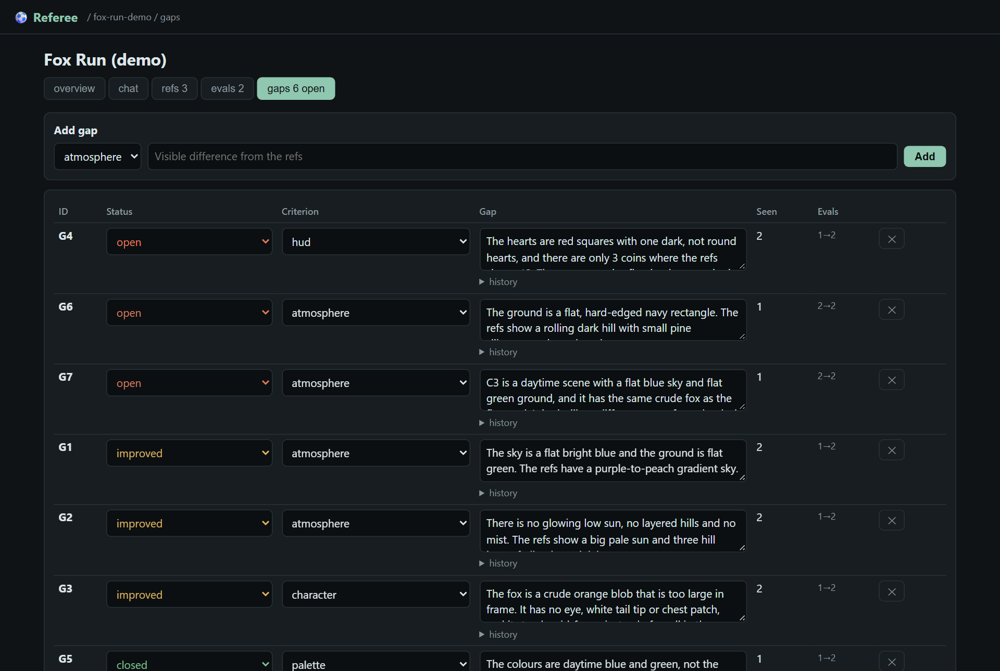
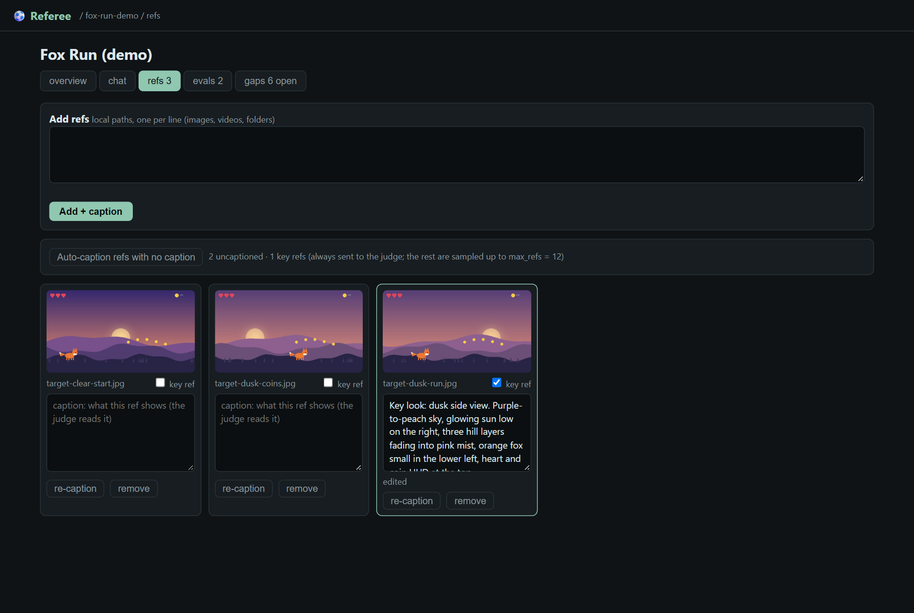
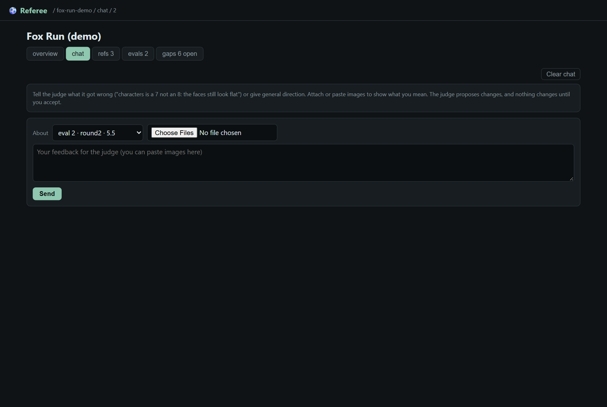
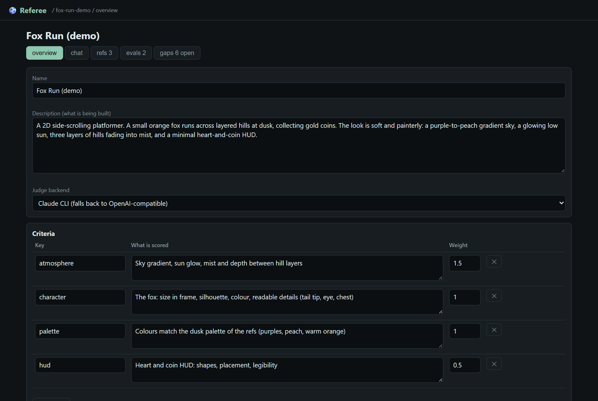
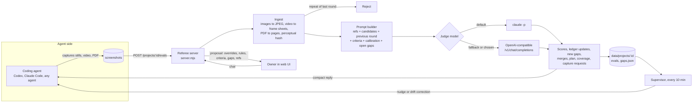

# ⚽ Referee

Referee is a small web service that scores screenshots of a build against reference images. Autonomous coding agents call it after each round of work. It tells them what still looks wrong and what to build next.

The judge is code-blind. It sees only images (and, for slide decks, the pages and speaker notes). It never sees the source code, logs or the agent's own claims about its progress. The score changes only when the screenshots change.



## Why it exists

An agent that runs for hours on a game or a deck tends to drift. It fixes small things it can measure, writes reports about its own progress and stops adding features. It often rates its own work higher than a person would. Referee reviews the agent's screenshots and remembers earlier rounds:

- The judge compares each round with target images you chose and with the previous round.
- It keeps a ledger of visible gaps across rounds, so it does not report the same problem in new words every time.
- It returns the 1-3 biggest missing features as a plan, plus the 5 most important gaps.
- It refuses rounds that re-send the same screenshots.
- A supervisor sends the latest plan to the agent when the agent goes quiet or its scores stall.

The owner (you) can talk to the judge in a chat tab. You tell it where its scores are wrong, and it proposes rule changes that you accept or reject.

## Screenshots

| | |
|---|---|
|  Projects list with the latest score of each project |  Score history per criterion and coverage |
|  The gap ledger. Gaps open, improve, close, merge or get flagged as stuck |  Reference images with captions. Key refs go to every eval |
|  Owner chat. The judge proposes changes and nothing applies until you accept |  Project description, weighted criteria, calibration rules and settings |

The images in these screenshots come from the demo in `examples/demo/`. A Python script draws them, so they contain no third-party art.

## How it works



## Quickstart

Requirements:

- Node.js 18 or newer. There are no npm dependencies.
- `ffmpeg` and `ffprobe` on the PATH. They convert images, cut video frames and compute the repeat check.
- A judge backend: the [Claude Code](https://docs.claude.com/en/docs/claude-code) CLI logged in (`claude -p` must work), or any OpenAI-compatible vision endpoint.
- Optional: Python with `pymupdf` (`pip install pymupdf`) to judge PDFs.

```sh
git clone https://github.com/<you>/referee
cd referee
node server.mjs            # or ./start.sh, or start.cmd on Windows
# open http://127.0.0.1:4600/
```

Run the demo. It draws placeholder art, creates a project and judges two rounds:

```sh
pip install pillow
python examples/demo/make-images.py
node examples/demo/run-demo.mjs           # create the project and add refs
node examples/demo/run-demo.mjs round1    # judge round 1 (about 20 s with Claude)
node examples/demo/run-demo.mjs round2    # judge round 2 and see the scores move
```

## Configuration

Settings come from environment variables, then `config.json` in the repo folder (or the file named in `REFEREE_CONFIG`), then the defaults. Copy `config.example.json` to `config.json` to start.

| config.json key | Environment variable | Default | Meaning |
|---|---|---|---|
| `port` | `REFEREE_PORT` | `4600` | HTTP port |
| `host` | `REFEREE_HOST` | `127.0.0.1` | Bind address. The API has no auth, so keep it on localhost unless you trust the network |
| `data_dir` | `REFEREE_DATA` | `data` | Where projects, refs and evals are stored |
| `default_backend` | `REFEREE_BACKEND` | `claude` | Backend for new projects: `claude` or `openai` |
| `fallback` | `REFEREE_FALLBACK` | `openai` | When `claude` fails (usage limit, login, error), retry on the OpenAI-compatible backend. `none` turns this off |
| `claude_bin` | `REFEREE_CLAUDE_BIN` | `claude` | Path to the Claude Code CLI |
| `claude_model` | `REFEREE_CLAUDE_MODEL` | `sonnet` | Model passed to `claude -p --model` |
| `openai_url` | `REFEREE_OPENAI_URL` | `http://127.0.0.1:8000/v1/chat/completions` | Any OpenAI-compatible chat completions URL that accepts images (vLLM, llama.cpp server, LM Studio, Ollama, OpenAI) |
| `openai_model` | `REFEREE_OPENAI_MODEL` | `local-vision-model` | Model name sent to that endpoint |
| `openai_api_key` | `REFEREE_OPENAI_API_KEY` | empty | Sent as `Authorization: Bearer` when set |
| `python` | `REFEREE_PYTHON` | `python` | Python used for PDF rendering |
| `judge_timeout_min` | `REFEREE_JUDGE_TIMEOUT_MIN` | `20` | Timeout for one judge call |
| `stuck_after` | `REFEREE_STUCK_AFTER` | `5` | A gap open for this many evals is marked stuck |
| `supervise_every_min` | `REFEREE_SUPERVISE_EVERY_MIN` | `10` | How often the supervisor checks agents |
| `agent_rules` | `REFEREE_AGENT_RULES` | built in | Working rules returned with every eval. A project can override them with `settings.agent_rules` |
| `allow_agent_commands` | `REFEREE_ALLOW_AGENT_COMMANDS` | `false` | Allows the `command` agent channel, which runs a shell command |

The Claude backend copies the images into an empty temp folder and runs `claude -p --allowedTools Read` there, so the model can open the images and nothing else. The OpenAI-compatible backend sends the images inline as base64 data URLs.

Per-project settings (edit them in the Overview tab or with `PATCH /projects/:id`):

| Setting | Default | Meaning |
|---|---|---|
| `max_refs` | 12 | Refs sent per eval. Key refs always go, the rest are sampled evenly |
| `max_candidates` | 8 | Candidate images sent per eval |
| `frames_per_video` | 8 | Frames cut from each video |
| `ref_width` / `candidate_width` | 768 / 1024 | Images are resized to this width |
| `compare_previous` | true | Also show up to 4 images from the previous eval for before/after comparison |
| `nudge_after_min` | 120 | The supervisor nudges an idle agent after this many minutes without an eval |
| `agent_rules` | unset | Overrides the global agent rules for this project |

## The judging loop

Each `POST /projects/:id/evals` runs these steps:

1. **Ingest.** Images become JPEGs. Videos become evenly spaced frames, and the frames of each clip are tiled into one sheet of up to 6 frames, so the judge sees motion over time in a single image. PDFs become one image per page. `.md` and `.txt` files are passed as text (speaker notes, scripts).
2. **Repeat check.** Each image gets a 16x16 perceptual hash. If 60% or more of the images match the previous eval (12 bits or fewer differ), the eval is rejected with a message telling the agent to capture new shots. Send `"allow_repeat": true` to force a re-score.
3. **Prompt.** The judge gets the refs (R1..), the candidates (C1..), a few images from the previous eval (P1..), the criteria with weights, the owner's calibration rules, the last 5 scores and the open gap ledger.
4. **Scores.** Each criterion gets 0-10 in half points with a one-sentence reason that names the images. The overall score is the weighted mean.
5. **Gap ledger.** For every open gap the judge says `open`, `improved` or `closed`. It adds up to 5 new gaps. Each gap is one visible difference a non-programmer could check by looking. It merges gaps that describe the same problem and keeps the oldest id.
6. **Stuck gaps.** A gap still open after `stuck_after` evals is marked stuck. The judge is told to re-check stuck gaps closely, and they are listed first in the reply.
7. **Priorities and plan.** The judge picks the top 5 gaps by how much fixing them would raise the scores, and writes `next_round.plan`: the 1-3 biggest user-visible changes, each with a `done_when` that can be checked from a screenshot. If the overall score has not risen over 4 evals, the reply sets `stalled: true` and the plan must name whole missing features.
8. **Coverage and capture requests.** The judge grades 0-10 how much of the build it could judge from what it was sent. It lists up to 3 shots or short videos to capture next round. The next eval checks whether those were sent.

**Brief mode.** A project with no refs is judged against its description and criteria as the stated audience would see it. Use this for slide decks, documents and written answers. Send the PDF and the speaker notes together.

Every eval is saved in `data/projects/<id>/evals/<n>/` with `result.json`, the exact `prompt.txt` and the model's `raw.txt`.

## How agents should call it

Send screenshots by path (the server must be able to read them) or as base64:

```sh
curl -s -X POST http://127.0.0.1:4600/projects/my-game/evals \
  -H "Content-Type: application/json" \
  -d '{"paths": ["/home/me/my-game/captures/round-07"], "label": "round 7: inventory screen"}'
```

```sh
curl -s -X POST http://127.0.0.1:4600/projects/my-game/evals \
  -H "Content-Type: application/json" \
  -d '{"files": [{"name": "title.png", "base64": "iVBORw0KGgo..."}]}'
```

The reply is short so it fits in an agent's context: `overall`, `scores`, `delta`, `next_round`, `top_priorities`, `coverage`, `capture_requests`, `summary` and `agent_rules`. Add `"full": true` to get the whole ledger.

A goal snippet you can paste into an agent's instructions:

```text
A visual judge reviews your work at http://127.0.0.1:4600 (project id: my-game).
It only sees screenshots and video. It never reads code or reports.

Loop:
1. Build a player-visible feature.
2. Capture with one reusable script: a 60-90 s video of real use plus up to
   8 stills of what changed, saved to a new folder each round.
3. POST the folder: curl -s -X POST http://127.0.0.1:4600/projects/my-game/evals
   -H "Content-Type: application/json" -d '{"paths":["<folder>"],"label":"<what changed>"}'
4. Work next_round.plan first, then top_priorities in order.
   Include every item in capture_requests in your next capture.
5. Repeat after each meaningful feature, not after every small fix.

Rules: a gap is fixed only when a later eval marks it closed. Do not edit gaps,
criteria, refs or calibration. Re-sending the same screenshots is rejected.
```

## Agent supervisor

Tell the judge how to reach the agent with `PATCH /projects/:id` (`{"agent": {...}}`) or by sending `"agent"` in an eval request. Every `supervise_every_min` minutes the supervisor checks each project that has an agent:

- **Idle nudge.** If there has been no eval for `nudge_after_min` minutes and the agent is idle, it sends the latest plan and top gaps.
- **Drift correction.** Right after an eval where progress stalled or coverage fell by 2 or more points, it sends the plan and the capture requests with an instruction to stop small fixes.

| Channel | `agent` value | How the message is delivered |
|---|---|---|
| tmux | `{"type":"tmux","target":"build:0.0"}` | Pasted into the tmux pane as one bracketed paste, then Enter. Works with Codex, Claude Code or any terminal agent. Add `"wsl": true` to run tmux inside WSL from Windows |
| Claude Code | `{"type":"claude","session":"<id>","name":"builder"}` | Stops the background session and resumes it with the message (`claude --bg --resume`). Needs a Claude Code version with background sessions |
| Webhook | `{"type":"webhook","url":"https://...","busy_url":"https://..."}` | POSTs `{project, eval, kind, text}` as JSON. If `busy_url` returns `{"busy": true}`, the nudge waits |
| Command | `{"type":"command","run":"./notify.sh"}` | Runs a shell command with the message on stdin and in `REFEREE_MESSAGE`. Off unless `allow_agent_commands` is true |

Every delivery is logged to `data/nudges.log`.

## Owner chat

In the Chat tab you can discuss one eval or give general direction, and you can attach or paste images. The judge answers and proposes changes:

- score overrides for that eval
- calibration rules that go into every later prompt as authoritative owner rules
- criteria wording and weight changes
- gap edits, new gaps and new refs from attached images

Nothing changes until you press Accept. Further messages revise the same proposal. Accepting saves a snapshot first, so every accepted change can be undone.

## API reference

All bodies are JSON. Paths in bodies may use forward slashes on Windows. Raw backslashes are also accepted.

**Projects**

| Method and path | Body / query | Returns |
|---|---|---|
| `GET /projects` | | List with last score, eval count, open gaps, refs |
| `POST /projects` | `{name, description, criteria:[{key, description, weight}], backend?, settings?, refs?:[paths], id?}` | The project. Criteria may also be plain strings |
| `GET /projects/:id` | | Project with counts |
| `PATCH /projects/:id` | any of `name, description, criteria, backend, settings, agent` | The project |

**Refs**

| Method and path | Body | Returns |
|---|---|---|
| `GET /projects/:id/refs` | | Ref list with captions and `pinned` |
| `POST /projects/:id/refs` | `{paths:[file or folder or video], files?:[{name, base64}], caption?:true}` | Added refs. `caption: true` captions them on upload |
| `PATCH /projects/:id/refs/:file` | `{note?, pinned?}` | Edits the caption or makes it a key ref |
| `DELETE /projects/:id/refs/:file` | | Removes the ref |
| `POST /projects/:id/refs/caption` | `{only_empty?:true, files?:[...]}` | Captions refs with the judge model |

**Evals**

| Method and path | Body | Returns |
|---|---|---|
| `POST /projects/:id/evals` | `{paths?, files?, label?, backend?, allow_repeat?, full?, agent?}` | Compact result, or the full result with `full: true` |
| `GET /projects/:id/evals` | | Score history |
| `GET /projects/:id/evals/:n` | | Full result for eval n |
| `GET /projects/:id/file/<path>` | | Files under the project folder, such as `evals/3/prompt.txt` or `refs/<file>` |

**Gaps**

| Method and path | Body / query | Returns |
|---|---|---|
| `GET /projects/:id/gaps` | `?status=open` (open and improved), or `improved`, `closed` | Gap list with history |
| `POST /projects/:id/gaps` | `{criterion, text, severity?}` | New gap |
| `PATCH /projects/:id/gaps/:gid` | `{text?, status?, criterion?, severity?}` | `{ok}` |
| `DELETE /projects/:id/gaps/:gid` | | `{ok}` |

**Chat**

| Method and path | Body | Returns |
|---|---|---|
| `GET /projects/:id/chat` | | Conversation |
| `POST /projects/:id/chat` | `{text, eval?: n or "none", images?:[{name, base64}]}` | Judge reply and the pending proposal |
| `GET /projects/:id/chat/proposal` | | Pending proposal or `null` |
| `POST /projects/:id/chat/accept` | | Applied changes and a snapshot id |
| `POST /projects/:id/chat/discard` | | Drops the proposal |
| `POST /projects/:id/chat/undo` | `{snapshot}` | Restores the state before that accept |
| `POST /projects/:id/chat/clear` | | Clears the conversation. Accepted changes stay |

**Agent and service**

| Method and path | Body | Returns |
|---|---|---|
| `PATCH /projects/:id` | `{"agent": {...}}` or `{"agent": null}` | Sets or clears the supervisor channel |
| `GET /api` | | Service name and port |

## Data layout

```
data/
  nudges.log
  projects/<id>/
    project.json      name, description, criteria, calibration, settings, agent
    refs.json, refs/  reference images and captions
    gaps.json         the gap ledger with per-eval history
    evals/<n>/        result.json, prompt.txt, raw.txt, candidates/
    chat.json, chat/, proposal.json, snapshots/
```

## Limitations

- **No authentication.** Anyone who can reach the port can read files the server can read (through `paths`), create projects and spend your model credits. The server binds to `127.0.0.1` by default. Put it behind a reverse proxy with auth if you expose it.
- **The server reads paths from the request.** The agent and the server must share a filesystem, or the agent must send base64.
- **Scores come from a language model.** The same images can get slightly different scores on two runs. Use the owner chat and calibration rules to correct them, and watch trends over several evals.
- **Cost.** Each eval sends up to `max_refs + max_candidates + 4` images. With Claude this uses your Claude Code plan or API credits.
- **One eval at a time per project.** Requests queue. A slow model blocks later evals for that project.
- **Video needs ffmpeg.** PDFs need Python with `pymupdf`.
- **The Claude Code session channel depends on CLI commands** (`claude agents --json`, `claude stop`, `claude --bg --resume`) that older Claude Code versions do not have. Use the tmux or webhook channel if they are missing.
- **The prompts are written for games and slide decks.** For other visual work, the wording about players, levels and screens may not fit. Edit `buildPrompt` in `server.mjs` to change it.

## License

MIT. See [LICENSE](LICENSE). Contributions: see [CONTRIBUTING.md](CONTRIBUTING.md).
